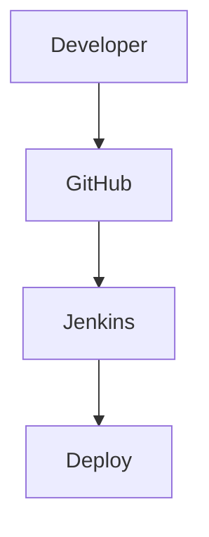
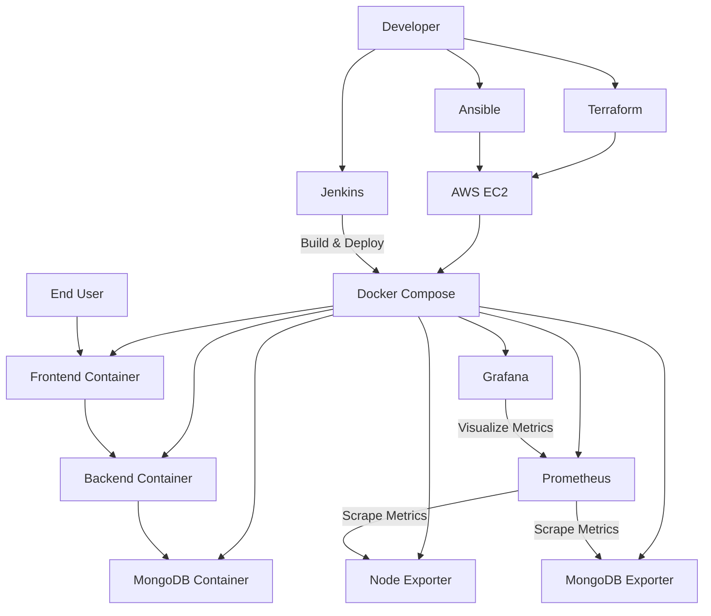

# MERN Todo DevOps Project

This project demonstrates a complete DevOps pipeline for deploying a MERN Todo application on AWS.

Technologies used:

- AWS EC2
- Terraform
- Ansible
- Docker
- Docker Compose
- Jenkins
- Prometheus
- Grafana
- MongoDB
- GitHub

## Architecture

## Infrastructure Provisioning (Terraform)

## Configuration Management (Ansible)

## Docker Deployment

## Jenkins Pipeline

## Application Result

## Monitoring

MongoDB

## Technology Stack

| Technology | Purpose |
|------------|---------|
| Terraform | Provision and manage AWS infrastructure using Infrastructure as Code (IaC). |
| AWS EC2 | Cloud virtual machine used to host the entire application and DevOps services. |
| Ansible | Automate server configuration and software installation. |
| Docker | Containerize the frontend, backend, and supporting services. |
| Docker Compose | Orchestrate and manage multiple Docker containers. |
| Jenkins | Implement Continuous Integration and Continuous Deployment (CI/CD) pipeline. |
| Prometheus | Collect and monitor system and application metrics. |
| Grafana | Visualize monitoring metrics through interactive dashboards. |
| MongoDB | Store application data as the primary NoSQL database. |

## CI/CD Workflow

# Test

## Project Architecture

## Conclusion
Successfully deployed a MERN Todo application on AWS using Terraform, Ansible, Docker, Jenkins, Prometheus, and Grafana. The project demonstrates Infrastructure as Code, automated deployment, and monitoring in a complete DevOps workflow.

